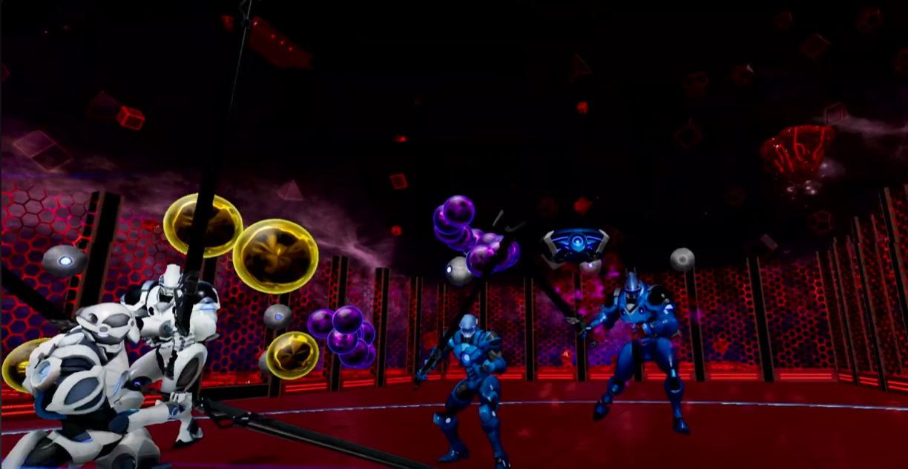
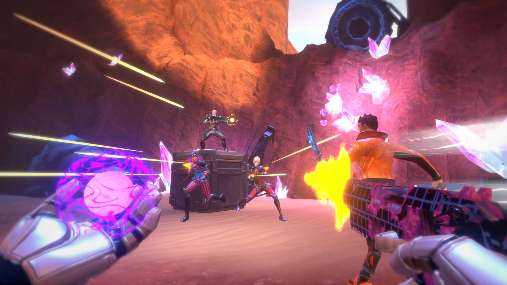
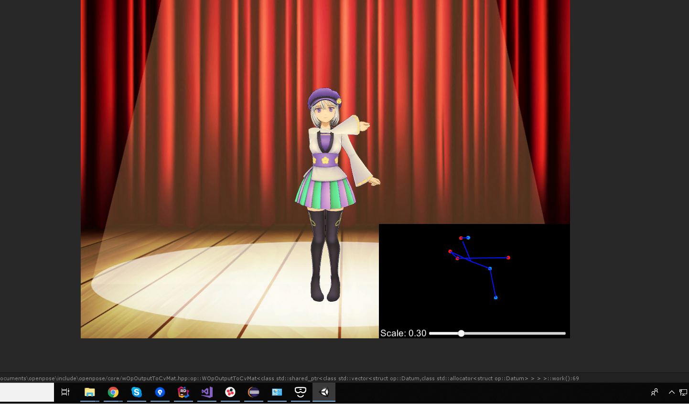

- [Professional Work](#professional-work)
    - [Altair-breaker](#altair-breaker)
  - [X8](#x8)
  - [IZONE Remember Z - PRINCE OF LEGEND LOVE ROYALE](#izone-remember-z---prince-of-legend-love-royale)
  - [Research and Develop](#research-and-develop)
  - [HinaKoi  (ひな恋)](#hinakoi--ひな恋)
  - [Crane Remote Control Simulation application](#crane-remote-control-simulation-application)
  - [Motion capture using OpenPose Library](#motion-capture-using-openpose-library)
  - [Research and Develop using RDP to remote PC from Hololens](#research-and-develop-using-rdp-to-remote-pc-from-hololens)
  - [Hoshinari Echos](#hoshinari-echos)
  - [Pocket Land - CocopaPlay - Yume100](#pocket-land---cocopaplay---yume100)
- [Personal - Freelance Work](#personal---freelance-work)
  - [WanakaFarm](#wanakafarm)
  - [ARDK travel application](#ardk-travel-application)
  - [Unity ECS and multiplayer package research](#unity-ecs-and-multiplayer-package-research)
  - [Studying Graphic programming (WIP)](#studying-graphic-programming-wip)

# Professional Work

### Altair-breaker
[**Official Page**](https://altair-breaker.com)  
**Company**: [Thirdverse, Co., Ltd (Japan)](https://www.thirdverse.io/ja/)  
**Year**: 2022

Release Globally on Steam, Meta Quest Store and PlayStation VR2, this is a VR multiplayer Sword-fighting game.
+ First project working with UE4, UE C++ and Blueprint. Learning by hands-on real project. Almost all of my previous project is working with Unity C#
+ Enforce many modern C++ practice such as smart pointers, RAII, templates,...
+ Work on design and implement game-play logic of drone creep, turret-bullet, new boss and some misc stuffs of battle system
+ Improve the master data CI flow.
+ Some code performance optimization.
+ Do code review.
+ Bug fix.

[Launch Trailer](https://www.youtube.com/watch?v=MchyLijeVPw)

## X8
[**Official Page**](https://playx8vr.com/en/)    
**Company**: [Thirdverse, Co., Ltd (Japan)](https://www.thirdverse.io/ja/), [Thirdverse, Inc. (US)](https://www.thirdverse.io/en/)  
**Year**: 2022 - 2023

Currently Release Globally on Steam, Meta Quest Store and soon will be release on PlayStation VR2, a VR multiplayer shooter game.
+ First project working with UE GAS framework.
+ Main design and implement the player statistic data tracking system, achievement system.
+ Investigation and support on third party matchmaking system. 
+ Some code performance optimization to work on Oculus Quest.
+ Do code review.
+ Start research UE and game rendering pipeline, shader stuffs.

[Game-play review](https://www.youtube.com/watch?v=P_U4zoeIxs8)

---

## IZONE Remember Z - PRINCE OF LEGEND LOVE ROYALE
[**Official Page**](https://10antz.co.jp/business/izone-remember-z)  
**Company**: [10ANTZ](https://10antz.co.jp/company/profile/)  
**Year**: 2019-2021

An Japan idol group orient game application, currently it's ended of service. This game is 2D UI base game.

**For technical**:  
+ Design and implement database and client event game-play system
+ Develop some editor tools to speed up operation speed, make work smoother with game operation team, cut scene animation,...
+ Take part in design and implement the asset management system using Unity legacy Asset Bundle.
+ Design and maintenance CI/CD flow for client side, take main responsibility on app release to PlayStore and AppStore.
+ Do some R&D to implement XR experience into app.
+ Implement native plugin to work with other twitter third party plugin.
+ Research and implement Firebase Remote Config into our application.
+ Code optimization.
+ Code review.
+ Present at internal technical conference.  
+ Help and coach junior programmers.

**For management**:
+ Manage development schedule, WBS,...
+ Try to apply agile scrum into development process.

## Research and Develop
**Company**: [10ANTZ](https://10antz.co.jp/company/profile/)  
**Year**: 2021

+ With experience with XR development from my freelance side jobs, I was assigned to some research and documentation tasks related to Vuforia and ARFoundation and created some prototypes for new game applications using XR experience.
+ Research and apply the Unity UnitTest framework to the development process. (TDD)

## HinaKoi  (ひな恋)
[**Official Page**](https://hinakoi.jp)  
**Company**: [10ANTZ](https://10antz.co.jp/company/profile/)  
**Year**: 2021

An Japan idol group orient game application, currently it's ended of service. This game is 2D UI base game.
+ The development process using Unity 2020.
+ Working on several game-play design and implementation. 
+ Working as a platform engineer, hands-on design and implement many common system for the new **in-house framework**. (such as API system, Asset Management System,...)

--- 

## Crane Remote Control Simulation application
**Company**: [PocketQueries](http://quantize-world.com/)
**Year**: 2018

This is a prototype simulation app using Oculus Rift and Haptic device, 3D mouse to control the crane remotely. The purpose of this app is not for business but for research and exhibition. 
+ Working directly with client engineer to implement the IK system for the crane simulation
+ Working with design team to optimize and create rigging structure of the harnesses model so that it can be break when apply force. This is also use for the simulation process.
+ Fix and modified haptic plugin to make it working with Unity

## Motion capture using OpenPose Library
**Company**: [PocketQueries](http://quantize-world.com/)  
**Year**: 2018

A project that use for exhibition for VTuber. Using [OpenPose](https://github.com/CMU-Perceptual-Computing-Lab/openpose) library and webcam to detect humance motion, capture motion bone data and use that data to update a 3D model inside unity.
+ One man project. Take responsibility working directly with client to decide what to implement and implement all the feature

## Research and Develop using RDP to remote PC from Hololens
**Company**: [PocketQueries](http://quantize-world.com/)  
**Year**: 2018 - 2019

I am currently involved in a project collaborating with a dedicated Vietnam-based outsourcing team. Together, we are working on a prototype production in partnership with the Tokyo Electric Group to create a mixed-reality (MR) experience for working in hazardous environments. 
+ Research and understand low level API of the [FreeRDP](https://github.com/FreeRDP/FreeRDP) library.
+ Research, Implement and testing with Hololens 1.
+ Working and Bridge engineer, take responsibility to make the communication between client and development team smooth. Also do task management for Vietnam team. 

--- 

## Hoshinari Echos
[**Official Page**](https://www.hoshinari.jp/)  
**Company**: [GCrest](https://www.gcrest.com/) - [CyberAgent Japan](https://www.cyberagent.co.jp/en/)
**Year**: 2016 - 2018

+ Design and implement room simulation game-play logic (a main feature of the game, which simulate the character daily life).
+ Research and using various third party tools: A* PathFinding, Behaviour Tree, Spine, NGUI,...
+ Implement some Editor tool to speed up working process.
+ Implement client side platform system.
+ Working as sub-leader of client team, I take responsibility on manage task for client team. And many many kinds of management task.

## Pocket Land - CocopaPlay - Yume100
**Company**: [GCrest](https://www.gcrest.com/) - [CyberAgent Japan](https://www.cyberagent.co.jp/en/)
**Year**: 2015 - 2016

+ Migration chat system database from mongoDB to PostgreSQL
+ Main maintainer for both server and client side of CocopaPlay game, which developed with Java Seasar Struts 2. Take main responsibility on application release and operation pipeline
+ Take part in implement prototype for title [Yume100](https://www.yume-100.com/), which become big successful title of company at that time. This title using Cocos2dx C++ with some in-house customize for performance optimization.

---

# Personal - Freelance Work

In my leisure time, I enjoy embarking on various small-scale projects that cater to a multitude of purposes. Some are purely for the sheer enjoyment of it, allowing me to express my creativity and experiment with new ideas. Others serve as valuable opportunities for learning and self-improvement, helping me stay at the forefront of the latest trends and technologies in the field. Occasionally, I also delve into freelance projects, putting my skills to good use while contributing to exciting endeavors outside of my regular work commitments.

## WanakaFarm
[Official Page](https://wanakafarm.com/)  
**Company**: [WanakaFarm](https://wanakafarm.com/)
**Year**: 2021 - 2022

NFT game project, working as client side team leader. Take all responsibility of client implementation and the client team.
+ Design and implement CI/CD process, game core system, editor tools.
+ Research and implement third party CryptoCurrency wallet integration library, work directly with CTO and blockchain engineers to resolve some authentication problem.
+ Decide technologies and plugin to use inside our production.
+ Work as Scrum master, apply agile development process into the project.

## ARDK travel application
**Year**: 2023

+ This project is to create a scene in unity using ARDK and build it into library format so that client can implement that library into there application.
+ Using ARDK SDK to scan the real location waypoint application.
+ This totally a one man project, I hands-on all the  development process from design, consult to client how to create game play UX that make user feel comfortable
+ Working with native application engineer to design and implement the data flow so that the library can communicate with the native side.
+ Design asset management system so that client can easily update new location and new content.

## Unity ECS and multiplayer package research

Currently I'm doing some research as personal hobby, to learn Unity new DOTS ECS and some multiplayer framework.
Will update the process on my medium site.

## Studying Graphic programming (WIP)

In addition to my work in ECS, I've been fortunate to collaborate with an incredible team of industry veterans who have contributed to major projects such as the FF series, CyberPunk, Bayonetta, and more. This unique opportunity has ignited my passion for graphic programming, and while I'm still in the learning process, I haven't documented my journey extensively. However, I can provide an overview of what I've been working on:

+ Following the tutorials on learnopengl.com to build a solid foundation of essential graphic programming knowledge.
+ Conducting in-depth analyses of Unreal Engine's rendering pipeline, texture formats, shaders, and command buffers, with the aim of gaining a deeper understanding of advanced graphics concepts and techniques.