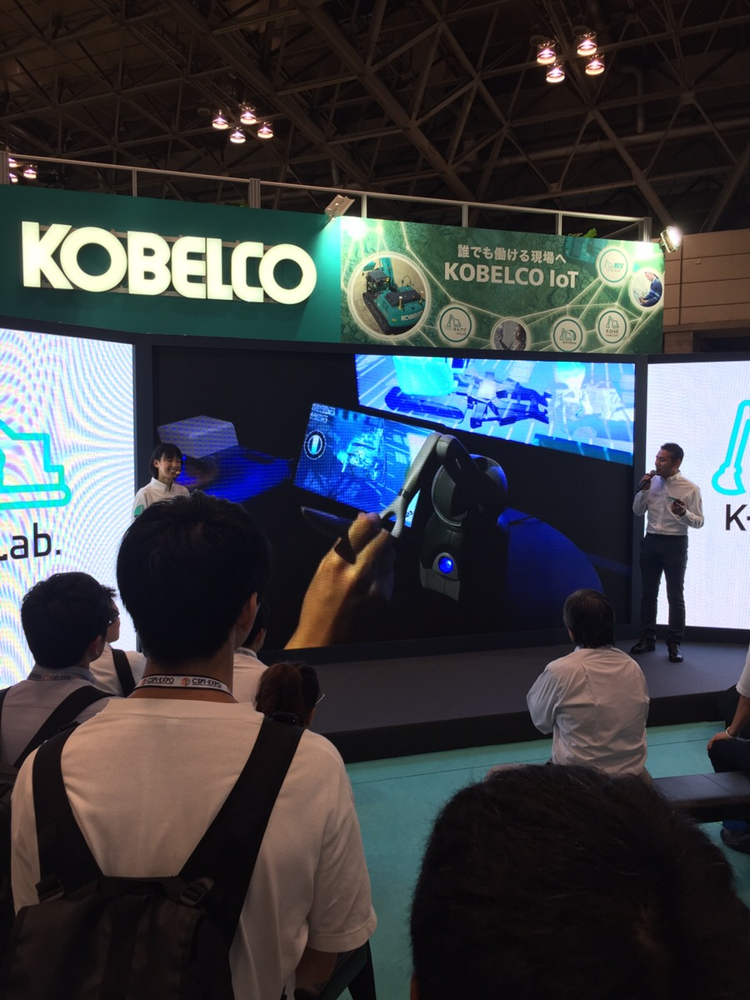

## Professional

## Altair-breaker
[**Official Page**](https://altair-breaker.com)  
**Company**: [Thirdverse, Co., Ltd (Japan)](https://www.thirdverse.io/ja/)  
**Year**: 2022

Release Globally on Steam, Meta Quest Store and PlayStation VR2, this is a VR multiplayer Sword-fighting game.
+ First project working with UE4, UE C++ and Blueprint. Learning by hands-on real project. Almost all of my previous project is working with Unity C#
+ Enforce many modern C++ practice such as smart pointers, RAII, templates,...
+ Work on design and implement game-play logic of drone creep, turret-bullet, new boss and some misc stuffs of battle system
+ Improve the master data CI flow.
+ Some code performance optimization.
+ Do code review.
+ Bug fix.

[Launch Trailer](https://www.youtube.com/watch?v=MchyLijeVPw)

## X8
[**Official Page**](https://playx8vr.com/en/)    
**Company**: [Thirdverse, Co., Ltd (Japan)](https://www.thirdverse.io/ja/), [Thirdverse, Inc. (US)](https://www.thirdverse.io/en/)  
**Year**: 2022 - 2023

Currently Release Globally on Steam, Meta Quest Store and soon will be release on PlayStation VR2, a VR multiplayer shooter game.
+ First project working with UE GAS framework.
+ Main design and implement the player statistic data tracking system, achievement system.
+ Investigation and support on third party matchmaking system. 
+ Some code performance optimization to work on Oculus Quest.
+ Do code review.
+ Start research UE and game rendering pipeline, shader stuffs.

[Game-play review](https://www.youtube.com/watch?v=P_U4zoeIxs8)

## IZONE Remember Z - PRINCE OF LEGEND LOVE ROYALE
[**Official Page**](https://10antz.co.jp/business/izone-remember-z)  
**Company**: [10ANTZ](https://10antz.co.jp/company/profile/)  
**Year**: 2019-2021

An Japan idol group orient game application, currently it's ended of service. This game is 2D UI base game.

**For technical**:  
+ Design and implement database and client event game-play system
+ Develop some editor tools to speed up operation speed, make work smoother with game operation team, cut scene animation,...
+ Take part in design and implement the asset management system using Unity legacy Asset Bundle.
+ Design and maintenance CI/CD flow for client side, take main responsibility on app release to PlayStore and AppStore.
+ Do some R&D to implement XR experience into app.
+ Implement native plugin to work with other twitter third party plugin.
+ Research and implement Firebase Remote Config into our application.
+ Code optimization.
+ Code review.
+ Present at internal technical conference.  
+ Help and coach junior programmers.

**For management**:
+ Manage development schedule, WBS,...
+ Try to apply agile scrum into development process.

## R&D
**Company**: [10ANTZ](https://10antz.co.jp/company/profile/)  
**Year**: 2021

+ With experience with XR development from my freelance side jobs, I was assigned to some research and documentation tasks related to Vuforia and ARFoundation and created some prototypes for new game applications using XR experience.
+ Research and apply the Unity UnitTest framework to the development process. (TDD)

## HinaKoi  (ひな恋)
[**Official Page**](https://hinakoi.jp)  
**Company**: [10ANTZ](https://10antz.co.jp/company/profile/)  
**Year**: 2021

An Japan idol group orient game application, currently it's ended of service. This game is 2D UI base game.
+ The development process using Unity 2020.
+ Working on several game-play design and implementation. 
+ Working as a platform engineer, hands-on design and implement many common system for the new **in-house framework**. (such as API system, Asset Management System,...)

## Crane Remote Control Simulation application
**Company**: [PocketQueries](http://quantize-world.com/)
**Year**: 2018

This is a prototype simulation app using Oculus Rift and Haptic device, 3D mouse to control the crane remotely. The purpose of this app is not for business but for research and exhibition. 
+ Working directly with client engineer to implement the IK system for the crane simulation
+ Working with design team to optimize and create rigging structure of the harnesses model so that it can be break when apply force. This is also use for the simulation process.
+ Fix and modified haptic plugin to make it working with Unity

## Motion capture using OpenPose Library
**Company**: [PocketQueries](http://quantize-world.com/)
**Year**: 2018 - 2019

